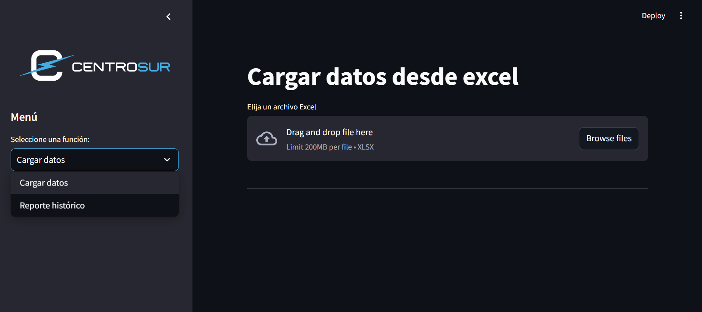

# Automatización de reportes Centrosur

### Desarrollo

* VSCode
* Python 3.12.3

### Ejecución

Crear una base de nombre reporte_cortes y con las credenciales que se indica en .streamlit/secrets.

> También existe un docker-compose en caso de querer ejecutar la base como un contenedor
>
> ```
> docker-compose up -d
> ```

Situese en la carpeta del proyecto

> Instale requirements.txt
>
> ```python
> pip install -r requirements.txt
> ```

> Ejecute la aplicación en streamlit
>
> ```python
> streamlit run app.py
> ```

#### GUI



## Estructura

> El proyecto esta organizado de la siguiente manera (se incluyen tmabién los archivos que no se  están guardando en el repositorio debido al gitignore):
>
> ```
>
> └── 📁.streamlit
>     └── config.toml
>     └── secrets.toml
> └── 📁image
>     └── 📁readme
>     └── logo-centrosur.png
> └── 📁mysql_data
> └── 📁resources
>     └── database.sql
> └── 📁utils
>     └── 📁db
>         └── database_manager.py
>     └── data_preprocessing.py
>     └── report_generation.py
>     └── workbook_creation.py
> └── 📁views
>     └── database_chargue.py
>     └── report_generation.py
>     └── user_guide.py
>     └── .gitignore
> └── app.py
> └── docker-compose.yml
> └── readme.md
> └── requirements.txt
>
> ```

#### .streamlit

- **config.toml**: configuración estética
- **secrets.toml:** variables de entorno para desarrollo

#### image

* **readme:** imágenes para estilizar el readme
* **logo-centrosur.png**: logo para app

#### mysql_data

Carpeta generada por el docker-compose para el volumen de la base de datos.

#### reports

Carpeta para almacenar los reportes generados durante las pruebas.

#### resources

Carpeta con el sql para una visualización más adecuada de la tabal generada.

#### utils

#### views

Contiene las 2 vistas generadas, desde aquí se llama a la carpeta de `utils` que contiene las funciones para realizar todos los procesos.
